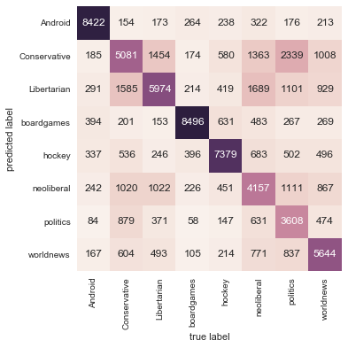

# Robert Corbett

Final Project - Token Influence on Reddit Post Poularity

12/14/2017


```python
import numpy as np
import pandas as pd
import nltk
import json
import matplotlib.pyplot as plt

from sklearn.feature_extraction.text import CountVectorizer
from sklearn.feature_extraction.text import TfidfTransformer

from sklearn.model_selection import train_test_split

from sklearn.naive_bayes import MultinomialNB
from sklearn.metrics import confusion_matrix
from sklearn.metrics import accuracy_score

import seaborn as sns

import pickle

from nltk.corpus import stopwords
stopset = set(stopwords.words('english'))
punctset = set(['.',',','!','?','&','@','#','$','%','^','*',';',':','...','-'])
fullset=punctset.union(stopset)
```


```python
d = {'body':[],
     'score':[],
     'subreddit':[],
     'percentile':[]
    }
```


```python
e = {'Android':[],
     'boardgames':[],
     'Conservative':[],
     'hockey':[],
     'Libertarian':[],
     'neoliberal':[],
     'politics':[],
     'worldnews':[]
    }
```


```python
f = {'3':[],
     '2':[],
     '1':[]
    }
```

# create dataframe

The following function is used to take the relevant information from the json files and create a dataframe.  Because there were so many posts, I wrote the function so that I could build smalled dataframes to test with.  


```python
def reddit_df_create(sample_size, start_line, z):
    sample = sample_size
    start = start_line
    num_posts=0
    x=(1*z)*(sample*8)
    with open('../../json_files/Android.txt', 'r') as infile:
        y=0
        for line in infile:
            if(num_posts<sample and y>=start):
                line_in = json.loads(line)
                reddit_df.loc[x, 'body'] = line_in['body']
                reddit_df.loc[x, 'score'] = line_in['score']
                reddit_df.loc[x, 'subreddit'] = 'Android'
                num_posts=num_posts+1
                x=x+1
            y=y+1
            if(y>=sample+start):
                break

    with open('../../json_files/boardgames.txt', 'r') as infile:
        y=0
        for line in infile:
            if(num_posts<(sample*2) and y>=start):
                line_in = json.loads(line)
                reddit_df.loc[x, 'body'] = line_in['body']
                reddit_df.loc[x, 'score'] = line_in['score']
                reddit_df.loc[x, 'subreddit'] = 'boardgames'
                num_posts=num_posts+1
                x=x+1
            y=y+1
            if(y>=sample+start):
                break

    with open('../../json_files/Conservative.txt', 'r') as infile:
        y=0
        for line in infile:
            if(num_posts<(sample*3) and y>=start):
                line_in = json.loads(line)
                reddit_df.loc[x, 'body'] = line_in['body']
                reddit_df.loc[x, 'score'] = line_in['score']
                reddit_df.loc[x, 'subreddit'] = 'Conservative'
                num_posts=num_posts+1  
                x=x+1
            y=y+1
            if(y>=sample+start):
                break

    with open('../../json_files/hockey.txt', 'r') as infile:
        y=0
        for line in infile:
            if(num_posts<(sample*4) and y>=start):
                line_in = json.loads(line)
                reddit_df.loc[x, 'body'] = line_in['body']
                reddit_df.loc[x, 'score'] = line_in['score']
                reddit_df.loc[x, 'subreddit'] = 'hockey'
                num_posts=num_posts+1
                x=x+1
            y=y+1
            if(y>=sample+start):
                break

    with open('../../json_files/Libertarian.txt', 'r') as infile:
        y=0
        for line in infile:
            if(num_posts<(sample*5) and y>=start):
                line_in = json.loads(line)
                reddit_df.loc[x, 'body'] = line_in['body']
                reddit_df.loc[x, 'score'] = line_in['score']
                reddit_df.loc[x, 'subreddit'] = 'Libertarian'
                num_posts=num_posts+1
                x=x+1
            y=y+1
            if(y>=sample+start):
                break

    with open('../../json_files/neoliberal.txt', 'r') as infile:
        y=0
        for line in infile:
            if(num_posts<(sample*6) and y>=start):
                line_in = json.loads(line)
                reddit_df.loc[x, 'body'] = line_in['body']
                reddit_df.loc[x, 'score'] = line_in['score']
                reddit_df.loc[x, 'subreddit'] = 'neoliberal'
                num_posts=num_posts+1  
                x=x+1
            y=y+1
            if(y>=sample+start):
                break

    with open('../../json_files/politics.txt', 'r') as infile:
        y=0
        for line in infile:
            if(num_posts<(sample*7) and y>=start):
                line_in = json.loads(line)
                reddit_df.loc[x, 'body'] = line_in['body']
                reddit_df.loc[x, 'score'] = line_in['score']
                reddit_df.loc[x, 'subreddit'] = 'politics'
                num_posts=num_posts+1
                x=x+1
            y=y+1
            if(y>=sample+start):
                break

    with open('../../json_files/worldnews.txt', 'r') as infile:
        y=0
        for line in infile:
            if(num_posts<(sample*8) and y>=start):
                line_in = json.loads(line)
                reddit_df.loc[x, 'body'] = line_in['body']
                reddit_df.loc[x, 'score'] = line_in['score']
                reddit_df.loc[x, 'subreddit'] = 'worldnews'
                num_posts=num_posts+1
                x=x+1
            y=y+1
            if(y>=sample+start):
                break
```

# return highest weighted tokens

The following function is used to return a dataframe with the highest weighted tokens in a classifier.  The function takes the classifier passed to it and sorts it.  It then takes the last 100 elements in the dataframe and matches those to the correct tokens in the vectorizer.  (the number of tokens returned can be easily changed)


```python
def return_top100(vectorizer, clf, class_labels):
    return_df = pd.DataFrame(data=e)
    feature_names = vectorizer.get_feature_names()
    for i, class_label in enumerate(class_labels):
        top100 = np.argsort(clf.coef_[i])[-100:]
        if(class_label=='Android'):
            iterator = 0
            for j in top100:
                return_df.loc[iterator, 'Android'] = (feature_names[j])
                iterator = iterator + 1
        if(class_label=='boardgames'):
            iterator = 0
            for j in top100:
                return_df.loc[iterator, 'boardgames'] = (feature_names[j])
                iterator = iterator + 1
        if(class_label=='Conservative'):
            iterator = 0
            for j in top100:
                return_df.loc[iterator, 'Conservative'] = (feature_names[j])
                iterator = iterator + 1
        if(class_label=='hockey'):
            iterator = 0
            for j in top100:
                return_df.loc[iterator, 'hockey'] = (feature_names[j])
                iterator = iterator + 1
        if(class_label=='Libertarian'):
            iterator = 0
            for j in top100:
                return_df.loc[iterator, 'Libertarian'] = (feature_names[j])
                iterator = iterator + 1
        if(class_label=='neoliberal'):
            iterator = 0
            for j in top100:
                return_df.loc[iterator, 'neoliberal'] = (feature_names[j])
                iterator = iterator + 1
        if(class_label=='politics'):
            iterator = 0
            for j in top100:
                return_df.loc[iterator, 'politics'] = (feature_names[j])
                iterator = iterator + 1
        if(class_label=='worldnews'):
            iterator = 0
            for j in top100:
                return_df.loc[iterator, 'worldnews'] = (feature_names[j])
                iterator = iterator + 1
    return(return_df)
```

# return highest weighted tokens for score

The following function is the same as the above, but is used when the model is trying to predict scores.


```python
def return_top100_score(vectorizer, clf, class_labels):
    return_df = pd.DataFrame(data=f)
    feature_names = vectorizer.get_feature_names()
    for i, class_label in enumerate(class_labels):
        top100 = np.argsort(clf.coef_[i])[-100:]
        if(class_label==3):
            iterator = 0
            for j in top100:
                return_df.loc[iterator, '3'] = (feature_names[j])
                iterator = iterator + 1
        if(class_label==2):
            iterator = 0
            for j in top100:
                return_df.loc[iterator, '2'] = (feature_names[j])
                iterator = iterator + 1
        if(class_label==1):
            iterator = 0
            for j in top100:
                return_df.loc[iterator, '1'] = (feature_names[j])
                iterator = iterator + 1
    return(return_df)
```

# variables to build dataframe

I used these variables to change how many posts to retreive to test with and how many to retrieve at a time.  For the final test, both were set to 50,000 so that all 50,000 posts in each subreddit would be included in the dataframe. (400,000 total posts)


```python
num_retreive=50000
tot_num_posts=50000
```


```python
reddit_df = pd.DataFrame(data=d)
```

# first model

The model below calls reddit_df_create, it is the only time it is called in this notebook and that dataframe is used for the rest of the program.  This call takes the most time of any part of the program.  It than creates a multinomialNB model with the dataframe. I used the nltk word tokenizer to tokenize the post bodies. The min token frequency is 16.  I excluded my fullset, which is the union of the nltk english stopwords and a set of punctuation I defined in the first box with the import statements.  The data is split 80% train 20% test.  The model is trying to predict which subreddit the test post is from.  The accuracy when the model used 320,000 posts to test ended up being 69.5%.  this accuracy doesn't seem too bad when it is taken into consideration that the model had 8 targets to choose from and many of them were chosen because they have similar topics.


```python
reddit_vec = CountVectorizer(min_df=16, tokenizer=nltk.word_tokenize, lowercase=True, stop_words=fullset)

z=0
start=0
iterator=0
while(iterator<(tot_num_posts/num_retreive)):

    iterator=iterator+1
    print(iterator)
    #start=start+num_retreive
    reddit_df_create(num_retreive, start, z)
    y = reddit_df['subreddit']

    reddit_counts = reddit_vec.fit_transform(reddit_df['body'])
    tfidf_transformer = TfidfTransformer()
    reddit_tfidf = tfidf_transformer.fit_transform(reddit_counts)

    X = reddit_tfidf

    X_train, X_test, y_train, y_test = train_test_split(X, y, test_size = 0.2, random_state = 0)

    classifier = MultinomialNB().partial_fit(X_train, y_train,classes=np.unique(y_train))

    y_pred = classifier.predict(X_test)

    print(accuracy_score(y_test, y_pred))
```

    1


    ---------------------------------------------------------------------------

    KeyboardInterrupt                         Traceback (most recent call last)

    <ipython-input-91-67135f9db52d> in <module>()
          9     print(iterator)
         10     #start=start+num_retreive
    ---> 11     reddit_df_create(num_retreive, start, z)
         12     y = reddit_df['subreddit']
         13


    <ipython-input-86-79808f686523> in reddit_df_create(sample_size, start_line, z)
          9             if(num_posts<sample and y>=start):
         10                 line_in = json.loads(line)
    ---> 11                 reddit_df.loc[x, 'body'] = line_in['body']
         12                 reddit_df.loc[x, 'score'] = line_in['score']
         13                 reddit_df.loc[x, 'subreddit'] = 'Android'


    ~\Anaconda3\lib\site-packages\pandas\core\indexing.py in __setitem__(self, key, value)
        177             key = com._apply_if_callable(key, self.obj)
        178         indexer = self._get_setitem_indexer(key)
    --> 179         self._setitem_with_indexer(indexer, value)
        180
        181     def _has_valid_type(self, k, axis):


    ~\Anaconda3\lib\site-packages\pandas\core\indexing.py in _setitem_with_indexer(self, indexer, value)
        349                     index = self.obj._get_axis(i)
        350                     labels = index.insert(len(index), key)
    --> 351                     self.obj._data = self.obj.reindex_axis(labels, i)._data
        352                     self.obj._maybe_update_cacher(clear=True)
        353                     self.obj.is_copy = None


    ~\Anaconda3\lib\site-packages\pandas\core\frame.py in reindex_axis(self, labels, axis, method, level, copy, limit, fill_value)
       2837                      self).reindex_axis(labels=labels, axis=axis,
       2838                                         method=method, level=level, copy=copy,
    -> 2839                                         limit=limit, fill_value=fill_value)
       2840
       2841     @Appender(_shared_docs['rename'] % _shared_doc_kwargs)


    ~\Anaconda3\lib\site-packages\pandas\core\generic.py in reindex_axis(self, labels, axis, method, level, copy, limit, fill_value)
       2491                                                  limit=limit)
       2492         return self._reindex_with_indexers({axis: [new_index, indexer]},
    -> 2493                                            fill_value=fill_value, copy=copy)
       2494
       2495     def _reindex_with_indexers(self, reindexers, fill_value=np.nan, copy=False,


    ~\Anaconda3\lib\site-packages\pandas\core\generic.py in _reindex_with_indexers(self, reindexers, fill_value, copy, allow_dups)
       2514                                                 fill_value=fill_value,
       2515                                                 allow_dups=allow_dups,
    -> 2516                                                 copy=copy)
       2517
       2518         if copy and new_data is self._data:


    ~\Anaconda3\lib\site-packages\pandas\core\internals.py in reindex_indexer(self, new_axis, indexer, axis, fill_value, allow_dups, copy)
       3895             new_blocks = [blk.take_nd(indexer, axis=axis, fill_tuple=(
       3896                 fill_value if fill_value is not None else blk.fill_value,))
    -> 3897                 for blk in self.blocks]
       3898
       3899         new_axes = list(self.axes)


    ~\Anaconda3\lib\site-packages\pandas\core\internals.py in <listcomp>(.0)
       3895             new_blocks = [blk.take_nd(indexer, axis=axis, fill_tuple=(
       3896                 fill_value if fill_value is not None else blk.fill_value,))
    -> 3897                 for blk in self.blocks]
       3898
       3899         new_axes = list(self.axes)


    ~\Anaconda3\lib\site-packages\pandas\core\internals.py in take_nd(self, indexer, axis, new_mgr_locs, fill_tuple)
       1044             fill_value = fill_tuple[0]
       1045             new_values = algos.take_nd(values, indexer, axis=axis,
    -> 1046                                        allow_fill=True, fill_value=fill_value)
       1047
       1048         if new_mgr_locs is None:


    ~\Anaconda3\lib\site-packages\pandas\core\algorithms.py in take_nd(arr, indexer, axis, out, fill_value, mask_info, allow_fill)
       1460             out = np.empty(out_shape, dtype=dtype, order='F')
       1461         else:
    -> 1462             out = np.empty(out_shape, dtype=dtype)
       1463
       1464     func = _get_take_nd_function(arr.ndim, arr.dtype, out.dtype, axis=axis,


    KeyboardInterrupt:


# top 100 tokens for each subreddit

Below, I call return_top100 of the classifier and vectorizer and display the returned dataframe.  Each column has the 100 highest weighted tokens for each subreddit. Then I saved the dataframe as a csv file.


```python
temp_df = return_top100(reddit_vec, classifier, class_labels=np.unique(y_train))
temp_df
```


```python
temp_df.to_csv("csv_files\\reddit_top_unigrams.csv")
```

# heatmap for previous model

The heatmap for the previous model looks pretty good.  The control subreddits (hockye, boardgames and Android) are very well defined.  The confusion occurs around the political posts, which would be expected since they would be talking about very similar topics.  


```python
cm = confusion_matrix(y_test, y_pred)

sns.heatmap(cm.T, square=True, annot=True, fmt='d', cbar=False,
            xticklabels=['Android','Conservative','Libertarian','boardgames','hockey','neoliberal','politics','worldnews'],
            yticklabels=['Android','Conservative','Libertarian','boardgames','hockey','neoliberal','politics','worldnews'])
plt.xlabel('true label')
plt.ylabel('predicted label')
plt.show()
```

# repeat above model with bigrams

The next couple blocks, I did the same as above but with bigrams.  I did not recreate the large subreddit_df though, I was able to reuse that dataframe through the rest of the program.


```python
reddit_vec = CountVectorizer(ngram_range=(2,2),min_df=16, lowercase=True, tokenizer=nltk.word_tokenize,stop_words=fullset)
z=0
start=0
iterator=0
while(iterator<1):

    iterator=iterator+1
    print(iterator)
    start=start+num_retreive

    y = reddit_df['subreddit']

    reddit_counts = reddit_vec.fit_transform(reddit_df['body'])
    tfidf_transformer = TfidfTransformer()
    reddit_tfidf = tfidf_transformer.fit_transform(reddit_counts)

    X = reddit_tfidf

    X_train, X_test, y_train, y_test = train_test_split(X, y, test_size = 0.2, random_state = 0)

    classifier = MultinomialNB().partial_fit(X_train, y_train,classes=np.unique(y_train))

    y_pred = classifier.predict(X_test)

    print(accuracy_score(y_test, y_pred))
```

# accuracy

As you can see above, the accuracy for this model is not as good as the unigram model.  the unigram had an accuracy of 69.5% while this model only has 60.9%.


```python
top_100_bi_nsandnp = return_top100(reddit_vec, classifier, class_labels=np.unique(y_train))
top_100_bi_nsandnp
```

# save csv file

I save the dataframe as a csv file.  While adding the markdown file, I accidently ran the above box again and had to quit it so is looks like it wasn't run.  


```python
top_100_bi_nsandnp.to_csv("csv_files\\reddit_top_bigrams.csv")
```

# heatmap

heatmap looks similar to the other model.  The confusion is still happening in the same areas.


```python
cm = confusion_matrix(y_test, y_pred)

sns.heatmap(cm.T, square=True, annot=True, fmt='d', cbar=False,
            xticklabels=['Android','Conservative','Libertarian','boardgames','hockey','neoliberal','politics','worldnews'],
            yticklabels=['Android','Conservative','Libertarian','boardgames','hockey','neoliberal','politics','worldnews'])
plt.xlabel('true label')
plt.ylabel('predicted label')
plt.show()
```





# explore the posts scores

I printed the mean, max and min for all of the scores in the reddit_df.  As you can see, the values are spread accross a very large margin (-274 to 17,193) but the mean is rather low (only about 9).  I wanted to find a way to split the posts by score so that I would have the same number of posts in each group.  I began by trying to split by percentile, but that did not work as well as I had hoped (the column is still named percentile).  The solution I came up with is much simpler.  I seperated the reddit_df into 8 smaller dataframes, 1 for each subreddit represented.  I then sorted them and split them into thirds.


```python
print(reddit_df['score'].mean())
print(reddit_df['score'].max())
print(reddit_df['score'].min())
```

    8.9692925
    17193.0
    -274.0


```python
Android_df = reddit_df[reddit_df.subreddit == 'Android']
```


```python
Android_df = Android_df.sort_values(['score'])
```


```python
Android_df
```


<div>
<style>
    .dataframe thead tr:only-child th {
        text-align: right;
    }

    .dataframe thead th {
        text-align: left;
    }

    .dataframe tbody tr th {
        vertical-align: top;
    }
</style>
<table border="1" class="dataframe">
  <thead>
    <tr style="text-align: right;">
      <th></th>
      <th>body</th>
      <th>percentile</th>
      <th>score</th>
      <th>subreddit</th>
    </tr>
  </thead>
  <tbody>
    <tr>
      <th>10040</th>
      <td>1. First world problems 2. If it is that incon...</td>
      <td>NaN</td>
      <td>-260.0</td>
      <td>Android</td>
    </tr>
    <tr>
      <th>49434</th>
      <td>&amp;gt;In India whenever there is any conflict, t...</td>
      <td>NaN</td>
      <td>-90.0</td>
      <td>Android</td>
    </tr>
    <tr>
      <th>4665</th>
      <td>Oh, yeah? In what way this cheap peace of Chin...</td>
      <td>NaN</td>
      <td>-79.0</td>
      <td>Android</td>
    </tr>
    <tr>
      <th>4155</th>
      <td>I can't stand spongebob memes. Maybe because I...</td>
      <td>NaN</td>
      <td>-78.0</td>
      <td>Android</td>
    </tr>
    <tr>
      <th>3588</th>
      <td>All OLEDs are trash. Can't believe people stil...</td>
      <td>NaN</td>
      <td>-71.0</td>
      <td>Android</td>
    </tr>
    <tr>
      <th>12785</th>
      <td>Google as a whole is a garbage company. They'v...</td>
      <td>NaN</td>
      <td>-69.0</td>
      <td>Android</td>
    </tr>
    <tr>
      <th>13705</th>
      <td>Or...I don't know....quit relying on cellular ...</td>
      <td>NaN</td>
      <td>-68.0</td>
      <td>Android</td>
    </tr>
    <tr>
      <th>33143</th>
      <td>Having a headphone jack has nothing to do with...</td>
      <td>NaN</td>
      <td>-62.0</td>
      <td>Android</td>
    </tr>
    <tr>
      <th>17144</th>
      <td>No root required for theming, but now you have...</td>
      <td>NaN</td>
      <td>-60.0</td>
      <td>Android</td>
    </tr>
    <tr>
      <th>36153</th>
      <td>Being a techy is absolutely no reason to buy a...</td>
      <td>NaN</td>
      <td>-57.0</td>
      <td>Android</td>
    </tr>
    <tr>
      <th>5437</th>
      <td>So if I search for "brain blocks", a game call...</td>
      <td>NaN</td>
      <td>-57.0</td>
      <td>Android</td>
    </tr>
    <tr>
      <th>44594</th>
      <td>The difference is that Google makes Android an...</td>
      <td>NaN</td>
      <td>-56.0</td>
      <td>Android</td>
    </tr>
    <tr>
      <th>14156</th>
      <td>Tell that to everyone who has been getting alo...</td>
      <td>NaN</td>
      <td>-54.0</td>
      <td>Android</td>
    </tr>
    <tr>
      <th>11253</th>
      <td>I gotta say, if I saw this on a spec sheet wit...</td>
      <td>NaN</td>
      <td>-54.0</td>
      <td>Android</td>
    </tr>
    <tr>
      <th>31217</th>
      <td>I wouldn’t worry too much about it.  Samsung l...</td>
      <td>NaN</td>
      <td>-48.0</td>
      <td>Android</td>
    </tr>
    <tr>
      <th>33591</th>
      <td>Omg shut up. Many of us have been using since ...</td>
      <td>NaN</td>
      <td>-48.0</td>
      <td>Android</td>
    </tr>
    <tr>
      <th>49801</th>
      <td>&amp;gt; Then there is the question of size: only ...</td>
      <td>NaN</td>
      <td>-48.0</td>
      <td>Android</td>
    </tr>
    <tr>
      <th>29820</th>
      <td>I wouldn’t worry too much about it.  Samsung l...</td>
      <td>NaN</td>
      <td>-47.0</td>
      <td>Android</td>
    </tr>
    <tr>
      <th>3615</th>
      <td>Burn in isn't even the biggest issue with OLED...</td>
      <td>NaN</td>
      <td>-45.0</td>
      <td>Android</td>
    </tr>
    <tr>
      <th>5884</th>
      <td>No it doesn't. If you can't afford the phone u...</td>
      <td>NaN</td>
      <td>-45.0</td>
      <td>Android</td>
    </tr>
    <tr>
      <th>32951</th>
      <td>The Essential Phone was announced on May 30. T...</td>
      <td>NaN</td>
      <td>-45.0</td>
      <td>Android</td>
    </tr>
    <tr>
      <th>30906</th>
      <td>That’s because they are incorrectly counting t...</td>
      <td>NaN</td>
      <td>-45.0</td>
      <td>Android</td>
    </tr>
    <tr>
      <th>20017</th>
      <td>Might as well compare it to the $40 Verizon mo...</td>
      <td>NaN</td>
      <td>-44.0</td>
      <td>Android</td>
    </tr>
    <tr>
      <th>11075</th>
      <td>It's amazing I never felt like I needed a rest...</td>
      <td>NaN</td>
      <td>-43.0</td>
      <td>Android</td>
    </tr>
    <tr>
      <th>29508</th>
      <td>That’s because they are incorrectly counting t...</td>
      <td>NaN</td>
      <td>-41.0</td>
      <td>Android</td>
    </tr>
    <tr>
      <th>31429</th>
      <td>For a subreddit that seems to have a group men...</td>
      <td>NaN</td>
      <td>-40.0</td>
      <td>Android</td>
    </tr>
    <tr>
      <th>49265</th>
      <td>Apple A 11 Bionic is a **TRUE 6 CORES** cpu, i...</td>
      <td>NaN</td>
      <td>-40.0</td>
      <td>Android</td>
    </tr>
    <tr>
      <th>4277</th>
      <td>You know what? Samsung IS the BIGGEST Android ...</td>
      <td>NaN</td>
      <td>-40.0</td>
      <td>Android</td>
    </tr>
    <tr>
      <th>19532</th>
      <td>You're comparing geekebench results from iOS t...</td>
      <td>NaN</td>
      <td>-39.0</td>
      <td>Android</td>
    </tr>
    <tr>
      <th>19964</th>
      <td>This comment makes no sense, unless you mean t...</td>
      <td>NaN</td>
      <td>-38.0</td>
      <td>Android</td>
    </tr>
    <tr>
      <th>...</th>
      <td>...</td>
      <td>...</td>
      <td>...</td>
      <td>...</td>
    </tr>
    <tr>
      <th>19275</th>
      <td>A little disappointing. While I welcome its ex...</td>
      <td>NaN</td>
      <td>1062.0</td>
      <td>Android</td>
    </tr>
    <tr>
      <th>24302</th>
      <td>You would think you'd get a notification/email...</td>
      <td>NaN</td>
      <td>1069.0</td>
      <td>Android</td>
    </tr>
    <tr>
      <th>3280</th>
      <td>Lineage OS:\n\nSettings - buttons - volume but...</td>
      <td>NaN</td>
      <td>1088.0</td>
      <td>Android</td>
    </tr>
    <tr>
      <th>49873</th>
      <td>Android 9.0 is supposed to come out next year,...</td>
      <td>NaN</td>
      <td>1147.0</td>
      <td>Android</td>
    </tr>
    <tr>
      <th>3430</th>
      <td>And the funniest thing is that thoughout your ...</td>
      <td>NaN</td>
      <td>1161.0</td>
      <td>Android</td>
    </tr>
    <tr>
      <th>4746</th>
      <td>Yeah a lot of people I know like to compare DS...</td>
      <td>NaN</td>
      <td>1183.0</td>
      <td>Android</td>
    </tr>
    <tr>
      <th>33491</th>
      <td>It's so sad that people actually fall for Clea...</td>
      <td>NaN</td>
      <td>1190.0</td>
      <td>Android</td>
    </tr>
    <tr>
      <th>39378</th>
      <td>Wish Google would have kept the Nexus line up ...</td>
      <td>NaN</td>
      <td>1191.0</td>
      <td>Android</td>
    </tr>
    <tr>
      <th>49863</th>
      <td>Why is everyone afraid of 9\n\n\n\nEdit: I get...</td>
      <td>NaN</td>
      <td>1316.0</td>
      <td>Android</td>
    </tr>
    <tr>
      <th>45395</th>
      <td>Only if it were news... They explicitly state ...</td>
      <td>NaN</td>
      <td>1326.0</td>
      <td>Android</td>
    </tr>
    <tr>
      <th>19605</th>
      <td>I agree. It's not like the essential phone whe...</td>
      <td>NaN</td>
      <td>1332.0</td>
      <td>Android</td>
    </tr>
    <tr>
      <th>3349</th>
      <td>You're going to sit there and I'm not going to...</td>
      <td>NaN</td>
      <td>1339.0</td>
      <td>Android</td>
    </tr>
    <tr>
      <th>19362</th>
      <td>They don't black out the sides of the camera c...</td>
      <td>NaN</td>
      <td>1370.0</td>
      <td>Android</td>
    </tr>
    <tr>
      <th>20528</th>
      <td>Lots of old iOS apps would test the OS version...</td>
      <td>NaN</td>
      <td>1517.0</td>
      <td>Android</td>
    </tr>
    <tr>
      <th>18459</th>
      <td>During i/o\n\n\n\nr/Android: OH FFS WE DIDN'T ...</td>
      <td>NaN</td>
      <td>1646.0</td>
      <td>Android</td>
    </tr>
    <tr>
      <th>10790</th>
      <td>/r/Android:\n\n"wow that would be stupid, Goog...</td>
      <td>NaN</td>
      <td>1717.0</td>
      <td>Android</td>
    </tr>
    <tr>
      <th>19663</th>
      <td>I think this image says it all: https://pbs.tw...</td>
      <td>NaN</td>
      <td>1762.0</td>
      <td>Android</td>
    </tr>
    <tr>
      <th>19536</th>
      <td>You can see (or rather not see) it here: https...</td>
      <td>NaN</td>
      <td>1902.0</td>
      <td>Android</td>
    </tr>
    <tr>
      <th>39208</th>
      <td>That price point is atrocious. After using my ...</td>
      <td>NaN</td>
      <td>1955.0</td>
      <td>Android</td>
    </tr>
    <tr>
      <th>21432</th>
      <td>"I buy Apple products for the Apple 'Ecosystem...</td>
      <td>NaN</td>
      <td>2108.0</td>
      <td>Android</td>
    </tr>
    <tr>
      <th>19289</th>
      <td>If I was an iPhone fan, I think I'd be upset t...</td>
      <td>NaN</td>
      <td>2170.0</td>
      <td>Android</td>
    </tr>
    <tr>
      <th>19287</th>
      <td>Am I mistaken or does video playback actually ...</td>
      <td>NaN</td>
      <td>2961.0</td>
      <td>Android</td>
    </tr>
    <tr>
      <th>39222</th>
      <td>Phone prices just keep on going up at the top ...</td>
      <td>NaN</td>
      <td>3154.0</td>
      <td>Android</td>
    </tr>
    <tr>
      <th>19298</th>
      <td>The FaceID tech looks way slower than TouchID....</td>
      <td>NaN</td>
      <td>3465.0</td>
      <td>Android</td>
    </tr>
    <tr>
      <th>41344</th>
      <td>HTC: "Surprise! We sold the company to Lenovo ...</td>
      <td>NaN</td>
      <td>3502.0</td>
      <td>Android</td>
    </tr>
    <tr>
      <th>19458</th>
      <td>Not iPhone X, but I think it was good for Appl...</td>
      <td>NaN</td>
      <td>3693.0</td>
      <td>Android</td>
    </tr>
    <tr>
      <th>19834</th>
      <td>2016: We have the courage to remove the headph...</td>
      <td>NaN</td>
      <td>3889.0</td>
      <td>Android</td>
    </tr>
    <tr>
      <th>19314</th>
      <td>I think the fact that animojis is something Ap...</td>
      <td>NaN</td>
      <td>5445.0</td>
      <td>Android</td>
    </tr>
    <tr>
      <th>3293</th>
      <td>Except it's not, because what should happen at...</td>
      <td>NaN</td>
      <td>6781.0</td>
      <td>Android</td>
    </tr>
    <tr>
      <th>19290</th>
      <td>Pretty much what the leaks said it would be. T...</td>
      <td>NaN</td>
      <td>9142.0</td>
      <td>Android</td>
    </tr>
  </tbody>
</table>
<p>50000 rows × 4 columns</p>
</div>


# reindex

I had to reindex the dataframes.


```python
Android_df = Android_df.reset_index(drop=True)
Android_df
```


<div>
<style>
    .dataframe thead tr:only-child th {
        text-align: right;
    }

    .dataframe thead th {
        text-align: left;
    }

    .dataframe tbody tr th {
        vertical-align: top;
    }
</style>
<table border="1" class="dataframe">
  <thead>
    <tr style="text-align: right;">
      <th></th>
      <th>body</th>
      <th>percentile</th>
      <th>score</th>
      <th>subreddit</th>
    </tr>
  </thead>
  <tbody>
    <tr>
      <th>0</th>
      <td>1. First world problems 2. If it is that incon...</td>
      <td>NaN</td>
      <td>-260.0</td>
      <td>Android</td>
    </tr>
    <tr>
      <th>1</th>
      <td>&amp;gt;In India whenever there is any conflict, t...</td>
      <td>NaN</td>
      <td>-90.0</td>
      <td>Android</td>
    </tr>
    <tr>
      <th>2</th>
      <td>Oh, yeah? In what way this cheap peace of Chin...</td>
      <td>NaN</td>
      <td>-79.0</td>
      <td>Android</td>
    </tr>
    <tr>
      <th>3</th>
      <td>I can't stand spongebob memes. Maybe because I...</td>
      <td>NaN</td>
      <td>-78.0</td>
      <td>Android</td>
    </tr>
    <tr>
      <th>4</th>
      <td>All OLEDs are trash. Can't believe people stil...</td>
      <td>NaN</td>
      <td>-71.0</td>
      <td>Android</td>
    </tr>
    <tr>
      <th>5</th>
      <td>Google as a whole is a garbage company. They'v...</td>
      <td>NaN</td>
      <td>-69.0</td>
      <td>Android</td>
    </tr>
    <tr>
      <th>6</th>
      <td>Or...I don't know....quit relying on cellular ...</td>
      <td>NaN</td>
      <td>-68.0</td>
      <td>Android</td>
    </tr>
    <tr>
      <th>7</th>
      <td>Having a headphone jack has nothing to do with...</td>
      <td>NaN</td>
      <td>-62.0</td>
      <td>Android</td>
    </tr>
    <tr>
      <th>8</th>
      <td>No root required for theming, but now you have...</td>
      <td>NaN</td>
      <td>-60.0</td>
      <td>Android</td>
    </tr>
    <tr>
      <th>9</th>
      <td>Being a techy is absolutely no reason to buy a...</td>
      <td>NaN</td>
      <td>-57.0</td>
      <td>Android</td>
    </tr>
    <tr>
      <th>10</th>
      <td>So if I search for "brain blocks", a game call...</td>
      <td>NaN</td>
      <td>-57.0</td>
      <td>Android</td>
    </tr>
    <tr>
      <th>11</th>
      <td>The difference is that Google makes Android an...</td>
      <td>NaN</td>
      <td>-56.0</td>
      <td>Android</td>
    </tr>
    <tr>
      <th>12</th>
      <td>Tell that to everyone who has been getting alo...</td>
      <td>NaN</td>
      <td>-54.0</td>
      <td>Android</td>
    </tr>
    <tr>
      <th>13</th>
      <td>I gotta say, if I saw this on a spec sheet wit...</td>
      <td>NaN</td>
      <td>-54.0</td>
      <td>Android</td>
    </tr>
    <tr>
      <th>14</th>
      <td>I wouldn’t worry too much about it.  Samsung l...</td>
      <td>NaN</td>
      <td>-48.0</td>
      <td>Android</td>
    </tr>
    <tr>
      <th>15</th>
      <td>Omg shut up. Many of us have been using since ...</td>
      <td>NaN</td>
      <td>-48.0</td>
      <td>Android</td>
    </tr>
    <tr>
      <th>16</th>
      <td>&amp;gt; Then there is the question of size: only ...</td>
      <td>NaN</td>
      <td>-48.0</td>
      <td>Android</td>
    </tr>
    <tr>
      <th>17</th>
      <td>I wouldn’t worry too much about it.  Samsung l...</td>
      <td>NaN</td>
      <td>-47.0</td>
      <td>Android</td>
    </tr>
    <tr>
      <th>18</th>
      <td>Burn in isn't even the biggest issue with OLED...</td>
      <td>NaN</td>
      <td>-45.0</td>
      <td>Android</td>
    </tr>
    <tr>
      <th>19</th>
      <td>No it doesn't. If you can't afford the phone u...</td>
      <td>NaN</td>
      <td>-45.0</td>
      <td>Android</td>
    </tr>
    <tr>
      <th>20</th>
      <td>The Essential Phone was announced on May 30. T...</td>
      <td>NaN</td>
      <td>-45.0</td>
      <td>Android</td>
    </tr>
    <tr>
      <th>21</th>
      <td>That’s because they are incorrectly counting t...</td>
      <td>NaN</td>
      <td>-45.0</td>
      <td>Android</td>
    </tr>
    <tr>
      <th>22</th>
      <td>Might as well compare it to the $40 Verizon mo...</td>
      <td>NaN</td>
      <td>-44.0</td>
      <td>Android</td>
    </tr>
    <tr>
      <th>23</th>
      <td>It's amazing I never felt like I needed a rest...</td>
      <td>NaN</td>
      <td>-43.0</td>
      <td>Android</td>
    </tr>
    <tr>
      <th>24</th>
      <td>That’s because they are incorrectly counting t...</td>
      <td>NaN</td>
      <td>-41.0</td>
      <td>Android</td>
    </tr>
    <tr>
      <th>25</th>
      <td>For a subreddit that seems to have a group men...</td>
      <td>NaN</td>
      <td>-40.0</td>
      <td>Android</td>
    </tr>
    <tr>
      <th>26</th>
      <td>Apple A 11 Bionic is a **TRUE 6 CORES** cpu, i...</td>
      <td>NaN</td>
      <td>-40.0</td>
      <td>Android</td>
    </tr>
    <tr>
      <th>27</th>
      <td>You know what? Samsung IS the BIGGEST Android ...</td>
      <td>NaN</td>
      <td>-40.0</td>
      <td>Android</td>
    </tr>
    <tr>
      <th>28</th>
      <td>You're comparing geekebench results from iOS t...</td>
      <td>NaN</td>
      <td>-39.0</td>
      <td>Android</td>
    </tr>
    <tr>
      <th>29</th>
      <td>This comment makes no sense, unless you mean t...</td>
      <td>NaN</td>
      <td>-38.0</td>
      <td>Android</td>
    </tr>
    <tr>
      <th>...</th>
      <td>...</td>
      <td>...</td>
      <td>...</td>
      <td>...</td>
    </tr>
    <tr>
      <th>49970</th>
      <td>A little disappointing. While I welcome its ex...</td>
      <td>NaN</td>
      <td>1062.0</td>
      <td>Android</td>
    </tr>
    <tr>
      <th>49971</th>
      <td>You would think you'd get a notification/email...</td>
      <td>NaN</td>
      <td>1069.0</td>
      <td>Android</td>
    </tr>
    <tr>
      <th>49972</th>
      <td>Lineage OS:\n\nSettings - buttons - volume but...</td>
      <td>NaN</td>
      <td>1088.0</td>
      <td>Android</td>
    </tr>
    <tr>
      <th>49973</th>
      <td>Android 9.0 is supposed to come out next year,...</td>
      <td>NaN</td>
      <td>1147.0</td>
      <td>Android</td>
    </tr>
    <tr>
      <th>49974</th>
      <td>And the funniest thing is that thoughout your ...</td>
      <td>NaN</td>
      <td>1161.0</td>
      <td>Android</td>
    </tr>
    <tr>
      <th>49975</th>
      <td>Yeah a lot of people I know like to compare DS...</td>
      <td>NaN</td>
      <td>1183.0</td>
      <td>Android</td>
    </tr>
    <tr>
      <th>49976</th>
      <td>It's so sad that people actually fall for Clea...</td>
      <td>NaN</td>
      <td>1190.0</td>
      <td>Android</td>
    </tr>
    <tr>
      <th>49977</th>
      <td>Wish Google would have kept the Nexus line up ...</td>
      <td>NaN</td>
      <td>1191.0</td>
      <td>Android</td>
    </tr>
    <tr>
      <th>49978</th>
      <td>Why is everyone afraid of 9\n\n\n\nEdit: I get...</td>
      <td>NaN</td>
      <td>1316.0</td>
      <td>Android</td>
    </tr>
    <tr>
      <th>49979</th>
      <td>Only if it were news... They explicitly state ...</td>
      <td>NaN</td>
      <td>1326.0</td>
      <td>Android</td>
    </tr>
    <tr>
      <th>49980</th>
      <td>I agree. It's not like the essential phone whe...</td>
      <td>NaN</td>
      <td>1332.0</td>
      <td>Android</td>
    </tr>
    <tr>
      <th>49981</th>
      <td>You're going to sit there and I'm not going to...</td>
      <td>NaN</td>
      <td>1339.0</td>
      <td>Android</td>
    </tr>
    <tr>
      <th>49982</th>
      <td>They don't black out the sides of the camera c...</td>
      <td>NaN</td>
      <td>1370.0</td>
      <td>Android</td>
    </tr>
    <tr>
      <th>49983</th>
      <td>Lots of old iOS apps would test the OS version...</td>
      <td>NaN</td>
      <td>1517.0</td>
      <td>Android</td>
    </tr>
    <tr>
      <th>49984</th>
      <td>During i/o\n\n\n\nr/Android: OH FFS WE DIDN'T ...</td>
      <td>NaN</td>
      <td>1646.0</td>
      <td>Android</td>
    </tr>
    <tr>
      <th>49985</th>
      <td>/r/Android:\n\n"wow that would be stupid, Goog...</td>
      <td>NaN</td>
      <td>1717.0</td>
      <td>Android</td>
    </tr>
    <tr>
      <th>49986</th>
      <td>I think this image says it all: https://pbs.tw...</td>
      <td>NaN</td>
      <td>1762.0</td>
      <td>Android</td>
    </tr>
    <tr>
      <th>49987</th>
      <td>You can see (or rather not see) it here: https...</td>
      <td>NaN</td>
      <td>1902.0</td>
      <td>Android</td>
    </tr>
    <tr>
      <th>49988</th>
      <td>That price point is atrocious. After using my ...</td>
      <td>NaN</td>
      <td>1955.0</td>
      <td>Android</td>
    </tr>
    <tr>
      <th>49989</th>
      <td>"I buy Apple products for the Apple 'Ecosystem...</td>
      <td>NaN</td>
      <td>2108.0</td>
      <td>Android</td>
    </tr>
    <tr>
      <th>49990</th>
      <td>If I was an iPhone fan, I think I'd be upset t...</td>
      <td>NaN</td>
      <td>2170.0</td>
      <td>Android</td>
    </tr>
    <tr>
      <th>49991</th>
      <td>Am I mistaken or does video playback actually ...</td>
      <td>NaN</td>
      <td>2961.0</td>
      <td>Android</td>
    </tr>
    <tr>
      <th>49992</th>
      <td>Phone prices just keep on going up at the top ...</td>
      <td>NaN</td>
      <td>3154.0</td>
      <td>Android</td>
    </tr>
    <tr>
      <th>49993</th>
      <td>The FaceID tech looks way slower than TouchID....</td>
      <td>NaN</td>
      <td>3465.0</td>
      <td>Android</td>
    </tr>
    <tr>
      <th>49994</th>
      <td>HTC: "Surprise! We sold the company to Lenovo ...</td>
      <td>NaN</td>
      <td>3502.0</td>
      <td>Android</td>
    </tr>
    <tr>
      <th>49995</th>
      <td>Not iPhone X, but I think it was good for Appl...</td>
      <td>NaN</td>
      <td>3693.0</td>
      <td>Android</td>
    </tr>
    <tr>
      <th>49996</th>
      <td>2016: We have the courage to remove the headph...</td>
      <td>NaN</td>
      <td>3889.0</td>
      <td>Android</td>
    </tr>
    <tr>
      <th>49997</th>
      <td>I think the fact that animojis is something Ap...</td>
      <td>NaN</td>
      <td>5445.0</td>
      <td>Android</td>
    </tr>
    <tr>
      <th>49998</th>
      <td>Except it's not, because what should happen at...</td>
      <td>NaN</td>
      <td>6781.0</td>
      <td>Android</td>
    </tr>
    <tr>
      <th>49999</th>
      <td>Pretty much what the leaks said it would be. T...</td>
      <td>NaN</td>
      <td>9142.0</td>
      <td>Android</td>
    </tr>
  </tbody>
</table>
<p>50000 rows × 4 columns</p>
</div>


# set percentile

I set an interger value in the percentile column.  The bottom third are 1, middle third 2 and top third 3.


```python
third = (len(Android_df)/3)
iterator = 0
for x in Android_df.percentile:
    if(iterator < third):
        Android_df.loc[iterator, 'percentile'] = 1
    if(iterator >= third and iterator <= (third*2)):
        Android_df.loc[iterator, 'percentile'] = 2
    if(iterator > (third*2)):
        Android_df.loc[iterator, 'percentile'] = 3
    iterator = iterator + 1
```


```python
print(Android_df)
```

                                                        body  percentile   score  \
    0      1. First world problems 2. If it is that incon...         1.0  -260.0   
    1      &gt;In India whenever there is any conflict, t...         1.0   -90.0   
    2      Oh, yeah? In what way this cheap peace of Chin...         1.0   -79.0   
    3      I can't stand spongebob memes. Maybe because I...         1.0   -78.0   
    4      All OLEDs are trash. Can't believe people stil...         1.0   -71.0   
    5      Google as a whole is a garbage company. They'v...         1.0   -69.0   
    6      Or...I don't know....quit relying on cellular ...         1.0   -68.0   
    7      Having a headphone jack has nothing to do with...         1.0   -62.0   
    8      No root required for theming, but now you have...         1.0   -60.0   
    9      Being a techy is absolutely no reason to buy a...         1.0   -57.0   
    10     So if I search for "brain blocks", a game call...         1.0   -57.0   
    11     The difference is that Google makes Android an...         1.0   -56.0   
    12     Tell that to everyone who has been getting alo...         1.0   -54.0   
    13     I gotta say, if I saw this on a spec sheet wit...         1.0   -54.0   
    14     I wouldn’t worry too much about it.  Samsung l...         1.0   -48.0   
    15     Omg shut up. Many of us have been using since ...         1.0   -48.0   
    16     &gt; Then there is the question of size: only ...         1.0   -48.0   
    17     I wouldn’t worry too much about it.  Samsung l...         1.0   -47.0   
    18     Burn in isn't even the biggest issue with OLED...         1.0   -45.0   
    19     No it doesn't. If you can't afford the phone u...         1.0   -45.0   
    20     The Essential Phone was announced on May 30. T...         1.0   -45.0   
    21     That’s because they are incorrectly counting t...         1.0   -45.0   
    22     Might as well compare it to the $40 Verizon mo...         1.0   -44.0   
    23     It's amazing I never felt like I needed a rest...         1.0   -43.0   
    24     That’s because they are incorrectly counting t...         1.0   -41.0   
    25     For a subreddit that seems to have a group men...         1.0   -40.0   
    26     Apple A 11 Bionic is a **TRUE 6 CORES** cpu, i...         1.0   -40.0   
    27     You know what? Samsung IS the BIGGEST Android ...         1.0   -40.0   
    28     You're comparing geekebench results from iOS t...         1.0   -39.0   
    29     This comment makes no sense, unless you mean t...         1.0   -38.0   
    ...                                                  ...         ...     ...   
    49970  A little disappointing. While I welcome its ex...         3.0  1062.0   
    49971  You would think you'd get a notification/email...         3.0  1069.0   
    49972  Lineage OS:\n\nSettings - buttons - volume but...         3.0  1088.0   
    49973  Android 9.0 is supposed to come out next year,...         3.0  1147.0   
    49974  And the funniest thing is that thoughout your ...         3.0  1161.0   
    49975  Yeah a lot of people I know like to compare DS...         3.0  1183.0   
    49976  It's so sad that people actually fall for Clea...         3.0  1190.0   
    49977  Wish Google would have kept the Nexus line up ...         3.0  1191.0   
    49978  Why is everyone afraid of 9\n\n\n\nEdit: I get...         3.0  1316.0   
    49979  Only if it were news... They explicitly state ...         3.0  1326.0   
    49980  I agree. It's not like the essential phone whe...         3.0  1332.0   
    49981  You're going to sit there and I'm not going to...         3.0  1339.0   
    49982  They don't black out the sides of the camera c...         3.0  1370.0   
    49983  Lots of old iOS apps would test the OS version...         3.0  1517.0   
    49984  During i/o\n\n\n\nr/Android: OH FFS WE DIDN'T ...         3.0  1646.0   
    49985  /r/Android:\n\n"wow that would be stupid, Goog...         3.0  1717.0   
    49986  I think this image says it all: https://pbs.tw...         3.0  1762.0   
    49987  You can see (or rather not see) it here: https...         3.0  1902.0   
    49988  That price point is atrocious. After using my ...         3.0  1955.0   
    49989  "I buy Apple products for the Apple 'Ecosystem...         3.0  2108.0   
    49990  If I was an iPhone fan, I think I'd be upset t...         3.0  2170.0   
    49991  Am I mistaken or does video playback actually ...         3.0  2961.0   
    49992  Phone prices just keep on going up at the top ...         3.0  3154.0   
    49993  The FaceID tech looks way slower than TouchID....         3.0  3465.0   
    49994  HTC: "Surprise! We sold the company to Lenovo ...         3.0  3502.0   
    49995  Not iPhone X, but I think it was good for Appl...         3.0  3693.0   
    49996  2016: We have the courage to remove the headph...         3.0  3889.0   
    49997  I think the fact that animojis is something Ap...         3.0  5445.0   
    49998  Except it's not, because what should happen at...         3.0  6781.0   
    49999  Pretty much what the leaks said it would be. T...         3.0  9142.0   

          subreddit  
    0       Android  
    1       Android  
    2       Android  
    3       Android  
    4       Android  
    5       Android  
    6       Android  
    7       Android  
    8       Android  
    9       Android  
    10      Android  
    11      Android  
    12      Android  
    13      Android  
    14      Android  
    15      Android  
    16      Android  
    17      Android  
    18      Android  
    19      Android  
    20      Android  
    21      Android  
    22      Android  
    23      Android  
    24      Android  
    25      Android  
    26      Android  
    27      Android  
    28      Android  
    29      Android  
    ...         ...  
    49970   Android  
    49971   Android  
    49972   Android  
    49973   Android  
    49974   Android  
    49975   Android  
    49976   Android  
    49977   Android  
    49978   Android  
    49979   Android  
    49980   Android  
    49981   Android  
    49982   Android  
    49983   Android  
    49984   Android  
    49985   Android  
    49986   Android  
    49987   Android  
    49988   Android  
    49989   Android  
    49990   Android  
    49991   Android  
    49992   Android  
    49993   Android  
    49994   Android  
    49995   Android  
    49996   Android  
    49997   Android  
    49998   Android  
    49999   Android  

    [50000 rows x 4 columns]


# create model

I created models for the new dataframes, changing the targets to the percentile column.  I also changed the min token frequency to 2, since this data set will be 1/8 the size of the main data set.


```python
reddit_vec = CountVectorizer(min_df=2, tokenizer=nltk.word_tokenize, lowercase=True, stop_words=fullset)

z=0
start=0
iterator=0
while(iterator<(1)):

    iterator=iterator+1
    print(iterator)
    start=start+num_retreive

    y = Android_df['percentile']

    reddit_counts = reddit_vec.fit_transform(Android_df['body'])
    tfidf_transformer = TfidfTransformer()
    reddit_tfidf = tfidf_transformer.fit_transform(reddit_counts)

    X = reddit_tfidf

    X_train, X_test, y_train, y_test = train_test_split(X, y, test_size = 0.2, random_state = 0)

    classifier = MultinomialNB().partial_fit(X_train, y_train,classes=np.unique(y_train))

    y_pred = classifier.predict(X_test)

    print(accuracy_score(y_test, y_pred))
```

    1
    0.4131


# accuracy

The accuracy for these models are much worse then when we were predicting subreddit.  


```python
cm = confusion_matrix(y_test, y_pred)

sns.heatmap(cm.T, square=True, annot=True, fmt='d', cbar=False,
            xticklabels=['3','2','1'],
            yticklabels=['3','2','1'])
plt.xlabel('true label')
plt.ylabel('predicted label')
plt.show()
```


# save csv

I saved all of the top_100 dataframes as csv files


```python
temp_df = return_top100_score(reddit_vec, classifier, class_labels=np.unique(y_train))
temp_df.to_csv("csv_files\Android_top_unigrams.csv")
```

# bigram model

Repeated model but with bigrams


```python
reddit_vec = CountVectorizer(ngram_range=(2,2), min_df=2, tokenizer=nltk.word_tokenize, lowercase=True, stop_words=fullset)

z=0
start=0
iterator=0
while(iterator<(1)):

    iterator=iterator+1
    print(iterator)
    start=start+num_retreive

    y = Android_df['percentile']

    reddit_counts = reddit_vec.fit_transform(Android_df['body'])
    tfidf_transformer = TfidfTransformer()
    reddit_tfidf = tfidf_transformer.fit_transform(reddit_counts)

    X = reddit_tfidf

    X_train, X_test, y_train, y_test = train_test_split(X, y, test_size = 0.2, random_state = 0)

    classifier = MultinomialNB().partial_fit(X_train, y_train,classes=np.unique(y_train))

    y_pred = classifier.predict(X_test)

    print(accuracy_score(y_test, y_pred))
```

    1
    0.4217


```python
cm = confusion_matrix(y_test, y_pred)

sns.heatmap(cm.T, square=True, annot=True, fmt='d', cbar=False,
            xticklabels=['3','2','1'],
            yticklabels=['3','2','1'])
plt.xlabel('true label')
plt.ylabel('predicted label')
plt.show()
```


```python
temp_df = return_top100_score(reddit_vec, classifier, class_labels=np.unique(y_train))
temp_df.to_csv("csv_files\Android_top_bigrams.csv")
```

# repeat

I repeated the above steps for each of the subreddits, saving the returned top_100 dataframes as csv files.


```python
boardgames_df = reddit_df[reddit_df.subreddit == 'boardgames']
boardgames_df = boardgames_df.sort_values(['score'])
boardgames_df = boardgames_df.reset_index(drop=True)

third = (len(boardgames_df)/3)
iterator = 0
for x in boardgames_df.percentile:
    if(iterator < third):
        boardgames_df.loc[iterator, 'percentile'] = 1
    if(iterator >= third and iterator <= (third*2)):
        boardgames_df.loc[iterator, 'percentile'] = 2
    if(iterator > (third*2)):
        boardgames_df.loc[iterator, 'percentile'] = 3
    iterator = iterator + 1
```


```python
reddit_vec = CountVectorizer(min_df=2, tokenizer=nltk.word_tokenize, lowercase=True, stop_words=fullset)

z=0
start=0
iterator=0
while(iterator<(1)):

    iterator=iterator+1
    print(iterator)
    start=start+num_retreive

    y = boardgames_df['percentile']

    reddit_counts = reddit_vec.fit_transform(boardgames_df['body'])
    tfidf_transformer = TfidfTransformer()
    reddit_tfidf = tfidf_transformer.fit_transform(reddit_counts)

    X = reddit_tfidf

    X_train, X_test, y_train, y_test = train_test_split(X, y, test_size = 0.2, random_state = 0)

    classifier = MultinomialNB().partial_fit(X_train, y_train,classes=np.unique(y_train))

    y_pred = classifier.predict(X_test)

    print(accuracy_score(y_test, y_pred))
```

    1
    0.4073


```python
cm = confusion_matrix(y_test, y_pred)

sns.heatmap(cm.T, square=True, annot=True, fmt='d', cbar=False,
            xticklabels=['3','2','1'],
            yticklabels=['3','2','1'])
plt.xlabel('true label')
plt.ylabel('predicted label')
plt.show()
```


```python
temp_df = return_top100_score(reddit_vec, classifier, class_labels=np.unique(y_train))
temp_df.to_csv("csv_files\\boardgames_top_unigrams.csv")
```


```python
reddit_vec = CountVectorizer(ngram_range=(2,2), min_df=2, tokenizer=nltk.word_tokenize, lowercase=True, stop_words=fullset)

z=0
start=0
iterator=0
while(iterator<(1)):

    iterator=iterator+1
    print(iterator)
    start=start+num_retreive

    y = boardgames_df['percentile']

    reddit_counts = reddit_vec.fit_transform(boardgames_df['body'])
    tfidf_transformer = TfidfTransformer()
    reddit_tfidf = tfidf_transformer.fit_transform(reddit_counts)

    X = reddit_tfidf

    X_train, X_test, y_train, y_test = train_test_split(X, y, test_size = 0.2, random_state = 0)

    classifier = MultinomialNB().partial_fit(X_train, y_train,classes=np.unique(y_train))

    y_pred = classifier.predict(X_test)

    print(accuracy_score(y_test, y_pred))
```

    1
    0.4094


```python
cm = confusion_matrix(y_test, y_pred)

sns.heatmap(cm.T, square=True, annot=True, fmt='d', cbar=False,
            xticklabels=['3','2','1'],
            yticklabels=['3','2','1'])
plt.xlabel('true label')
plt.ylabel('predicted label')
plt.show()
```


```python
temp_df = return_top100_score(reddit_vec, classifier, class_labels=np.unique(y_train))
temp_df.to_csv("csv_files\\boardgames_top_bigrams.csv")
```


```python
Conservative_df = reddit_df[reddit_df.subreddit == 'Conservative']
Conservative_df = Conservative_df.sort_values(['score'])
Conservative_df = Conservative_df.reset_index(drop=True)

third = (len(Conservative_df)/3)
iterator = 0
for x in Conservative_df.percentile:
    if(iterator < third):
        Conservative_df.loc[iterator, 'percentile'] = 1
    if(iterator >= third and iterator <= (third*2)):
        Conservative_df.loc[iterator, 'percentile'] = 2
    if(iterator > (third*2)):
        Conservative_df.loc[iterator, 'percentile'] = 3
    iterator = iterator + 1
```


```python
reddit_vec = CountVectorizer(min_df=2, tokenizer=nltk.word_tokenize, lowercase=True, stop_words=fullset)

z=0
start=0
iterator=0
while(iterator<(1)):

    iterator=iterator+1
    print(iterator)
    start=start+num_retreive

    y = Conservative_df['percentile']

    reddit_counts = reddit_vec.fit_transform(Conservative_df['body'])
    tfidf_transformer = TfidfTransformer()
    reddit_tfidf = tfidf_transformer.fit_transform(reddit_counts)

    X = reddit_tfidf

    X_train, X_test, y_train, y_test = train_test_split(X, y, test_size = 0.2, random_state = 0)

    classifier = MultinomialNB().partial_fit(X_train, y_train,classes=np.unique(y_train))

    y_pred = classifier.predict(X_test)

    print(accuracy_score(y_test, y_pred))
```

    1
    0.4044


```python
cm = confusion_matrix(y_test, y_pred)

sns.heatmap(cm.T, square=True, annot=True, fmt='d', cbar=False,
            xticklabels=['3','2','1'],
            yticklabels=['3','2','1'])
plt.xlabel('true label')
plt.ylabel('predicted label')
plt.show()
```


```python
temp_df = return_top100_score(reddit_vec, classifier, class_labels=np.unique(y_train))
temp_df.to_csv("csv_files\Conservative_top_unigrams.csv")
```


```python
reddit_vec = CountVectorizer(ngram_range=(2,2), min_df=2, tokenizer=nltk.word_tokenize, lowercase=True, stop_words=fullset)

z=0
start=0
iterator=0
while(iterator<(1)):

    iterator=iterator+1
    print(iterator)
    start=start+num_retreive

    y = Conservative_df['percentile']

    reddit_counts = reddit_vec.fit_transform(Conservative_df['body'])
    tfidf_transformer = TfidfTransformer()
    reddit_tfidf = tfidf_transformer.fit_transform(reddit_counts)

    X = reddit_tfidf

    X_train, X_test, y_train, y_test = train_test_split(X, y, test_size = 0.2, random_state = 0)

    classifier = MultinomialNB().partial_fit(X_train, y_train,classes=np.unique(y_train))

    y_pred = classifier.predict(X_test)

    print(accuracy_score(y_test, y_pred))
```

    1
    0.3992


```python
cm = confusion_matrix(y_test, y_pred)

sns.heatmap(cm.T, square=True, annot=True, fmt='d', cbar=False,
            xticklabels=['3','2','1'],
            yticklabels=['3','2','1'])
plt.xlabel('true label')
plt.ylabel('predicted label')
plt.show()
```


```python
temp_df = return_top100_score(reddit_vec, classifier, class_labels=np.unique(y_train))
temp_df.to_csv("csv_files\Conservative_top_bigrams.csv")
```


```python
hockey_df = reddit_df[reddit_df.subreddit == 'hockey']
hockey_df = hockey_df.sort_values(['score'])
hockey_df = hockey_df.reset_index(drop=True)

third = (len(hockey_df)/3)
iterator = 0
for x in hockey_df.percentile:
    if(iterator < third):
        hockey_df.loc[iterator, 'percentile'] = 1
    if(iterator >= third and iterator <= (third*2)):
        hockey_df.loc[iterator, 'percentile'] = 2
    if(iterator > (third*2)):
        hockey_df.loc[iterator, 'percentile'] = 3
    iterator = iterator + 1
```


```python
reddit_vec = CountVectorizer(min_df=2, tokenizer=nltk.word_tokenize, lowercase=True, stop_words=fullset)

z=0
start=0
iterator=0
while(iterator<(1)):

    iterator=iterator+1
    print(iterator)
    start=start+num_retreive

    y = hockey_df['percentile']

    reddit_counts = reddit_vec.fit_transform(hockey_df['body'])
    tfidf_transformer = TfidfTransformer()
    reddit_tfidf = tfidf_transformer.fit_transform(reddit_counts)

    X = reddit_tfidf

    X_train, X_test, y_train, y_test = train_test_split(X, y, test_size = 0.2, random_state = 0)

    classifier = MultinomialNB().partial_fit(X_train, y_train,classes=np.unique(y_train))

    y_pred = classifier.predict(X_test)

    print(accuracy_score(y_test, y_pred))
```

    1
    0.4095


```python
cm = confusion_matrix(y_test, y_pred)

sns.heatmap(cm.T, square=True, annot=True, fmt='d', cbar=False,
            xticklabels=['3','2','1'],
            yticklabels=['3','2','1'])
plt.xlabel('true label')
plt.ylabel('predicted label')
plt.show()
```


```python
temp_df = return_top100_score(reddit_vec, classifier, class_labels=np.unique(y_train))
temp_df.to_csv("csv_files\hockey_top_unigrams.csv")
```


```python
reddit_vec = CountVectorizer(ngram_range=(2,2), min_df=2, tokenizer=nltk.word_tokenize, lowercase=True, stop_words=fullset)

z=0
start=0
iterator=0
while(iterator<(1)):

    iterator=iterator+1
    print(iterator)
    start=start+num_retreive

    y = hockey_df['percentile']

    reddit_counts = reddit_vec.fit_transform(hockey_df['body'])
    tfidf_transformer = TfidfTransformer()
    reddit_tfidf = tfidf_transformer.fit_transform(reddit_counts)

    X = reddit_tfidf

    X_train, X_test, y_train, y_test = train_test_split(X, y, test_size = 0.2, random_state = 0)

    classifier = MultinomialNB().partial_fit(X_train, y_train,classes=np.unique(y_train))

    y_pred = classifier.predict(X_test)

    print(accuracy_score(y_test, y_pred))
```

    1
    0.4055


```python
cm = confusion_matrix(y_test, y_pred)

sns.heatmap(cm.T, square=True, annot=True, fmt='d', cbar=False,
            xticklabels=['3','2','1'],
            yticklabels=['3','2','1'])
plt.xlabel('true label')
plt.ylabel('predicted label')
plt.show()
```


```python
temp_df = return_top100_score(reddit_vec, classifier, class_labels=np.unique(y_train))
temp_df.to_csv("csv_files\hockey_top_bigrams.csv")
```


```python
Libertarian_df = reddit_df[reddit_df.subreddit == 'Libertarian']
Libertarian_df = Libertarian_df.sort_values(['score'])
Libertarian_df = Libertarian_df.reset_index(drop=True)

third = (len(Libertarian_df)/3)
iterator = 0
for x in Libertarian_df.percentile:
    if(iterator < third):
        Libertarian_df.loc[iterator, 'percentile'] = 1
    if(iterator >= third and iterator <= (third*2)):
        Libertarian_df.loc[iterator, 'percentile'] = 2
    if(iterator > (third*2)):
        Libertarian_df.loc[iterator, 'percentile'] = 3
    iterator = iterator + 1
```


```python
reddit_vec = CountVectorizer(min_df=2, tokenizer=nltk.word_tokenize, lowercase=True, stop_words=fullset)

z=0
start=0
iterator=0
while(iterator<(1)):

    iterator=iterator+1
    print(iterator)
    start=start+num_retreive

    y = Libertarian_df['percentile']

    reddit_counts = reddit_vec.fit_transform(Libertarian_df['body'])
    tfidf_transformer = TfidfTransformer()
    reddit_tfidf = tfidf_transformer.fit_transform(reddit_counts)

    X = reddit_tfidf

    X_train, X_test, y_train, y_test = train_test_split(X, y, test_size = 0.2, random_state = 0)

    classifier = MultinomialNB().partial_fit(X_train, y_train,classes=np.unique(y_train))

    y_pred = classifier.predict(X_test)

    print(accuracy_score(y_test, y_pred))
```

    1
    0.4399


```python
cm = confusion_matrix(y_test, y_pred)

sns.heatmap(cm.T, square=True, annot=True, fmt='d', cbar=False,
            xticklabels=['3','2','1'],
            yticklabels=['3','2','1'])
plt.xlabel('true label')
plt.ylabel('predicted label')
plt.show()
```


```python
temp_df = return_top100_score(reddit_vec, classifier, class_labels=np.unique(y_train))
temp_df.to_csv("csv_files\Libertarian_top_unigrams.csv")
```


```python
reddit_vec = CountVectorizer(ngram_range=(2,2), min_df=2, tokenizer=nltk.word_tokenize, lowercase=True, stop_words=fullset)

z=0
start=0
iterator=0
while(iterator<(1)):

    iterator=iterator+1
    print(iterator)
    start=start+num_retreive

    y = Libertarian_df['percentile']

    reddit_counts = reddit_vec.fit_transform(Libertarian_df['body'])
    tfidf_transformer = TfidfTransformer()
    reddit_tfidf = tfidf_transformer.fit_transform(reddit_counts)

    X = reddit_tfidf

    X_train, X_test, y_train, y_test = train_test_split(X, y, test_size = 0.2, random_state = 0)

    classifier = MultinomialNB().partial_fit(X_train, y_train,classes=np.unique(y_train))

    y_pred = classifier.predict(X_test)

    print(accuracy_score(y_test, y_pred))
```

    1
    0.4566


```python
cm = confusion_matrix(y_test, y_pred)

sns.heatmap(cm.T, square=True, annot=True, fmt='d', cbar=False,
            xticklabels=['3','2','1'],
            yticklabels=['3','2','1'])
plt.xlabel('true label')
plt.ylabel('predicted label')
plt.show()
```


```python
temp_df = return_top100_score(reddit_vec, classifier, class_labels=np.unique(y_train))
temp_df.to_csv("csv_files\Libertarian_top_bigrams.csv")
```


```python
neoliberal_df = reddit_df[reddit_df.subreddit == 'neoliberal']
neoliberal_df = neoliberal_df.sort_values(['score'])
neoliberal_df = neoliberal_df.reset_index(drop=True)

third = (len(neoliberal_df)/3)
iterator = 0
for x in neoliberal_df.percentile:
    if(iterator < third):
        neoliberal_df.loc[iterator, 'percentile'] = 1
    if(iterator >= third and iterator <= (third*2)):
        neoliberal_df.loc[iterator, 'percentile'] = 2
    if(iterator > (third*2)):
        neoliberal_df.loc[iterator, 'percentile'] = 3
    iterator = iterator + 1
```


```python
reddit_vec = CountVectorizer(min_df=2, tokenizer=nltk.word_tokenize, lowercase=True, stop_words=fullset)

z=0
start=0
iterator=0
while(iterator<(1)):

    iterator=iterator+1
    print(iterator)
    start=start+num_retreive

    y = neoliberal_df['percentile']

    reddit_counts = reddit_vec.fit_transform(neoliberal_df['body'])
    tfidf_transformer = TfidfTransformer()
    reddit_tfidf = tfidf_transformer.fit_transform(reddit_counts)

    X = reddit_tfidf

    X_train, X_test, y_train, y_test = train_test_split(X, y, test_size = 0.2, random_state = 0)

    classifier = MultinomialNB().partial_fit(X_train, y_train,classes=np.unique(y_train))

    y_pred = classifier.predict(X_test)

    print(accuracy_score(y_test, y_pred))
```

    1
    0.4596


```python
cm = confusion_matrix(y_test, y_pred)

sns.heatmap(cm.T, square=True, annot=True, fmt='d', cbar=False,
            xticklabels=['3','2','1'],
            yticklabels=['3','2','1'])
plt.xlabel('true label')
plt.ylabel('predicted label')
plt.show()
```


```python
temp_df = return_top100_score(reddit_vec, classifier, class_labels=np.unique(y_train))
temp_df.to_csv("csv_files\\neoliberal_top_unigrams.csv")
```


```python
reddit_vec = CountVectorizer(ngram_range=(2,2), min_df=2, tokenizer=nltk.word_tokenize, lowercase=True, stop_words=fullset)

z=0
start=0
iterator=0
while(iterator<(1)):

    iterator=iterator+1
    print(iterator)
    start=start+num_retreive

    y = neoliberal_df['percentile']

    reddit_counts = reddit_vec.fit_transform(neoliberal_df['body'])
    tfidf_transformer = TfidfTransformer()
    reddit_tfidf = tfidf_transformer.fit_transform(reddit_counts)

    X = reddit_tfidf

    X_train, X_test, y_train, y_test = train_test_split(X, y, test_size = 0.2, random_state = 0)

    classifier = MultinomialNB().partial_fit(X_train, y_train,classes=np.unique(y_train))

    y_pred = classifier.predict(X_test)

    print(accuracy_score(y_test, y_pred))
```

    1
    0.4461


```python
cm = confusion_matrix(y_test, y_pred)

sns.heatmap(cm.T, square=True, annot=True, fmt='d', cbar=False,
            xticklabels=['3','2','1'],
            yticklabels=['3','2','1'])
plt.xlabel('true label')
plt.ylabel('predicted label')
plt.show()
```


```python
temp_df = return_top100_score(reddit_vec, classifier, class_labels=np.unique(y_train))
temp_df.to_csv("csv_files\\neoliberal_top_bigrams.csv")
```


```python
politics_df = reddit_df[reddit_df.subreddit == 'politics']
politics_df = politics_df.sort_values(['score'])
politics_df = politics_df.reset_index(drop=True)

third = (len(politics_df)/3)
iterator = 0
for x in politics_df.percentile:
    if(iterator < third):
        politics_df.loc[iterator, 'percentile'] = 1
    if(iterator >= third and iterator <= (third*2)):
        politics_df.loc[iterator, 'percentile'] = 2
    if(iterator > (third*2)):
        politics_df.loc[iterator, 'percentile'] = 3
    iterator = iterator + 1
```


```python
reddit_vec = CountVectorizer(min_df=2, tokenizer=nltk.word_tokenize, lowercase=True, stop_words=fullset)

z=0
start=0
iterator=0
while(iterator<(1)):

    iterator=iterator+1
    print(iterator)
    start=start+num_retreive

    y = politics_df['percentile']

    reddit_counts = reddit_vec.fit_transform(politics_df['body'])
    tfidf_transformer = TfidfTransformer()
    reddit_tfidf = tfidf_transformer.fit_transform(reddit_counts)

    X = reddit_tfidf

    X_train, X_test, y_train, y_test = train_test_split(X, y, test_size = 0.2, random_state = 0)

    classifier = MultinomialNB().partial_fit(X_train, y_train,classes=np.unique(y_train))

    y_pred = classifier.predict(X_test)

    print(accuracy_score(y_test, y_pred))
```

    1
    0.4153


```python
cm = confusion_matrix(y_test, y_pred)

sns.heatmap(cm.T, square=True, annot=True, fmt='d', cbar=False,
            xticklabels=['3','2','1'],
            yticklabels=['3','2','1'])
plt.xlabel('true label')
plt.ylabel('predicted label')
plt.show()
```


```python
temp_df = return_top100_score(reddit_vec, classifier, class_labels=np.unique(y_train))
temp_df.to_csv("csv_files\politics_top_unigrams.csv")
```


```python
reddit_vec = CountVectorizer(ngram_range=(2,2), min_df=2, tokenizer=nltk.word_tokenize, lowercase=True, stop_words=fullset)

z=0
start=0
iterator=0
while(iterator<(1)):

    iterator=iterator+1
    print(iterator)
    start=start+num_retreive

    y = politics_df['percentile']

    reddit_counts = reddit_vec.fit_transform(politics_df['body'])
    tfidf_transformer = TfidfTransformer()
    reddit_tfidf = tfidf_transformer.fit_transform(reddit_counts)

    X = reddit_tfidf

    X_train, X_test, y_train, y_test = train_test_split(X, y, test_size = 0.2, random_state = 0)

    classifier = MultinomialNB().partial_fit(X_train, y_train,classes=np.unique(y_train))

    y_pred = classifier.predict(X_test)

    print(accuracy_score(y_test, y_pred))
```

    1
    0.4294


```python
cm = confusion_matrix(y_test, y_pred)

sns.heatmap(cm.T, square=True, annot=True, fmt='d', cbar=False,
            xticklabels=['3','2','1'],
            yticklabels=['3','2','1'])
plt.xlabel('true label')
plt.ylabel('predicted label')
plt.show()
```


```python
temp_df = return_top100_score(reddit_vec, classifier, class_labels=np.unique(y_train))
temp_df.to_csv("csv_files\politics_top_bigrams.csv")
```


```python
worldnews_df = reddit_df[reddit_df.subreddit == 'worldnews']
worldnews_df = worldnews_df.sort_values(['score'])
worldnews_df = worldnews_df.reset_index(drop=True)

third = (len(worldnews_df)/3)
iterator = 0
for x in worldnews_df.percentile:
    if(iterator < third):
        worldnews_df.loc[iterator, 'percentile'] = 1
    if(iterator >= third and iterator <= (third*2)):
        worldnews_df.loc[iterator, 'percentile'] = 2
    if(iterator > (third*2)):
        worldnews_df.loc[iterator, 'percentile'] = 3
    iterator = iterator + 1
```


```python
reddit_vec = CountVectorizer(min_df=2, tokenizer=nltk.word_tokenize, lowercase=True, stop_words=fullset)

z=0
start=0
iterator=0
while(iterator<(1)):

    iterator=iterator+1
    print(iterator)
    start=start+num_retreive

    y = worldnews_df['percentile']

    reddit_counts = reddit_vec.fit_transform(worldnews_df['body'])
    tfidf_transformer = TfidfTransformer()
    reddit_tfidf = tfidf_transformer.fit_transform(reddit_counts)

    X = reddit_tfidf

    X_train, X_test, y_train, y_test = train_test_split(X, y, test_size = 0.2, random_state = 0)

    classifier = MultinomialNB().partial_fit(X_train, y_train,classes=np.unique(y_train))

    y_pred = classifier.predict(X_test)

    print(accuracy_score(y_test, y_pred))
```

    1
    0.4022


```python
cm = confusion_matrix(y_test, y_pred)

sns.heatmap(cm.T, square=True, annot=True, fmt='d', cbar=False,
            xticklabels=['3','2','1'],
            yticklabels=['3','2','1'])
plt.xlabel('true label')
plt.ylabel('predicted label')
plt.show()
```


```python
temp_df = return_top100_score(reddit_vec, classifier, class_labels=np.unique(y_train))
temp_df.to_csv("csv_files\worldnews_top_unigrams.csv")
```


```python
reddit_vec = CountVectorizer(ngram_range=(2,2), min_df=2, tokenizer=nltk.word_tokenize, lowercase=True, stop_words=fullset)

z=0
start=0
iterator=0
while(iterator<(1)):

    iterator=iterator+1
    print(iterator)
    start=start+num_retreive

    y = worldnews_df['percentile']

    reddit_counts = reddit_vec.fit_transform(worldnews_df['body'])
    tfidf_transformer = TfidfTransformer()
    reddit_tfidf = tfidf_transformer.fit_transform(reddit_counts)

    X = reddit_tfidf

    X_train, X_test, y_train, y_test = train_test_split(X, y, test_size = 0.2, random_state = 0)

    classifier = MultinomialNB().partial_fit(X_train, y_train,classes=np.unique(y_train))

    y_pred = classifier.predict(X_test)

    print(accuracy_score(y_test, y_pred))
```

    1
    0.3884


```python
cm = confusion_matrix(y_test, y_pred)

sns.heatmap(cm.T, square=True, annot=True, fmt='d', cbar=False,
            xticklabels=['3','2','1'],
            yticklabels=['3','2','1'])
plt.xlabel('true label')
plt.ylabel('predicted label')
plt.show()
```


```python
temp_df = return_top100_score(reddit_vec, classifier, class_labels=np.unique(y_train))
temp_df.to_csv("csv_files\worldnews_top_bigrams.csv")
```
